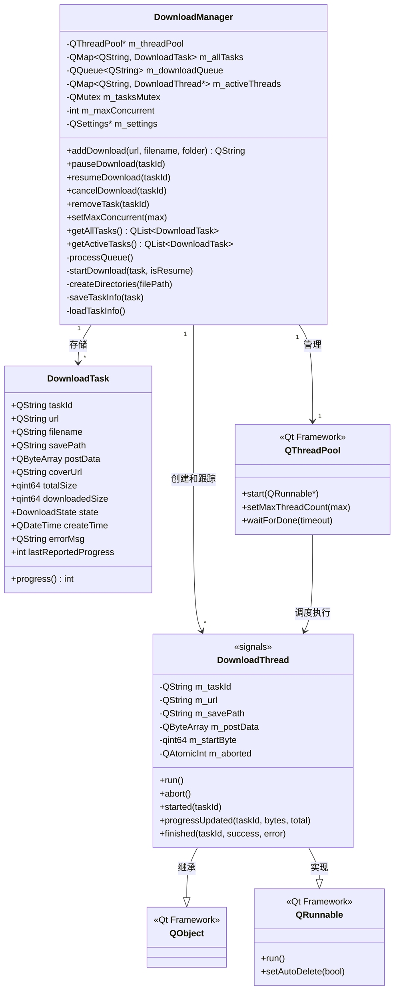
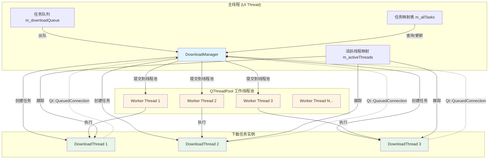
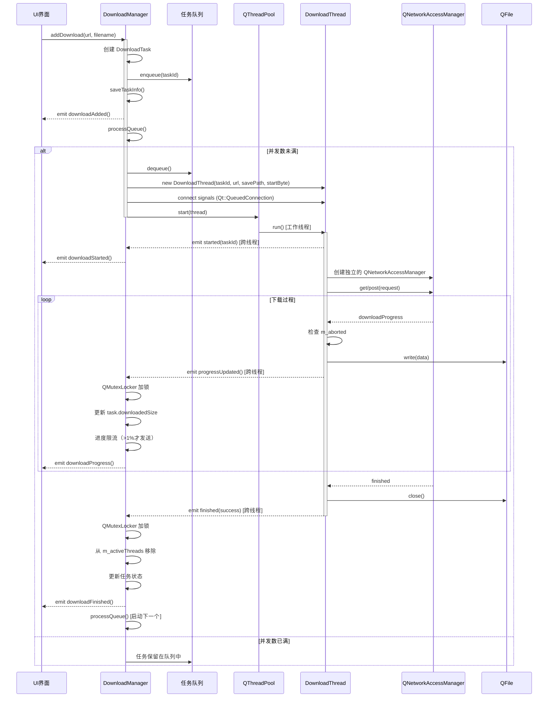
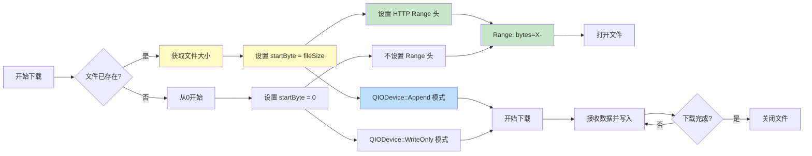
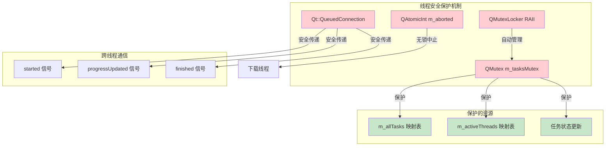
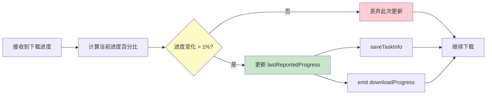
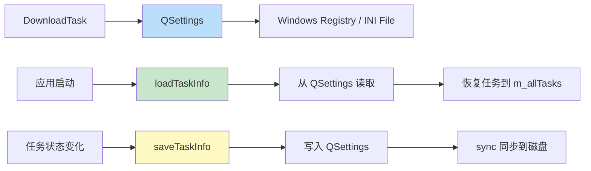

# 下载管理器架构文档

## 概述

下载管理器采用基于 Qt 线程池的并发下载架构，支持多任务并发下载、断点续传、暂停/恢复等功能。相比传统的单 `QNetworkAccessManager` + 手动队列管理方式，新架构提供了更好的并发性能和资源利用率。

## 核心组件

### 1. 类结构图



### 2. 下载状态枚举

```cpp
enum class DownloadState {
    Waiting,      // 等待下载
    Downloading,  // 正在下载
    Paused,       // 已暂停
    Completed,    // 已完成
    Failed,       // 失败
    Cancelled     // 已取消
};
```

## 架构设计

### 1. 线程池架构



**关键设计点：**

1. **线程池管理**：使用 `QThreadPool` 自动管理工作线程的生命周期
2. **任务独立性**：每个 `DownloadThread` 在独立的工作线程中运行
3. **并发控制**：通过 `setMaxThreadCount()` 限制最大并发数（1-10）
4. **自动清理**：`setAutoDelete(true)` 确保线程任务执行完自动释放

### 2. 下载流程时序图



### 3. 断点续传机制



**断点续传实现细节：**

```cpp
// 1. 检查已下载大小
QFile existingFile(task.savePath);
if (existingFile.exists()) {
    task.downloadedSize = existingFile.size();
}

// 2. 设置 HTTP Range 头
if (m_startByte > 0) {
    QString rangeHeader = QString("bytes=%1-").arg(m_startByte);
    request.setRawHeader("Range", rangeHeader.toUtf8());
}

// 3. 追加模式打开文件
QIODevice::OpenMode openMode = m_startByte > 0 ? 
    QIODevice::Append : QIODevice::WriteOnly;
file.open(openMode);
```

### 4. 线程安全机制



**线程安全实现：**

1. **互斥锁保护共享数据**
```cpp
void DownloadManager::pauseDownload(const QString& taskId)
{
    QMutexLocker locker(&m_tasksMutex);  // RAII 自动加锁/解锁
    if (!m_allTasks.contains(taskId)) return;
    // ... 访问共享数据
}
```

2. **原子操作实现中止**
```cpp
// DownloadThread 类
QAtomicInt m_aborted;

void abort() {
    m_aborted.storeRelease(1);  // 无锁设置
}

void run() {
    if (m_aborted.loadAcquire()) {  // 无锁检查
        reply->abort();
        return;
    }
}
```

3. **跨线程信号连接**
```cpp
connect(thread, &DownloadThread::progressUpdated, this, 
    [this](const QString& taskId, qint64 bytes, qint64 total) {
        QMutexLocker locker(&m_tasksMutex);
        // ... 更新任务数据
    }, Qt::QueuedConnection);  // 关键：跨线程安全
```

### 5. 进度报告优化



**进度限流代码：**

```cpp
connect(thread, &DownloadThread::progressUpdated, this, 
    [this](const QString& taskId, qint64 bytesReceived, qint64 bytesTotal) {
        QMutexLocker locker(&m_tasksMutex);
        if (!m_allTasks.contains(taskId)) return;
        DownloadTask& t = m_allTasks[taskId];
        
        t.downloadedSize = bytesReceived;
        if (bytesTotal > 0) t.totalSize = bytesTotal;
        
        // 限流：只在进度变化超过1%时发送信号
        int currentProgress = t.progress();
        if (currentProgress > t.lastReportedProgress) {
            t.lastReportedProgress = currentProgress;
            saveTaskInfo(t);
            emit downloadProgress(taskId, t.filename, bytesReceived, bytesTotal);
        }
    }, Qt::QueuedConnection);
```

**优势：**
- 减少 UI 更新频率，避免界面卡顿
- 减少持久化存储的写入次数
- 降低信号/槽调用开销

## 关键实现细节

### 1. DownloadThread 实现

```cpp
class DownloadThread : public QObject, public QRunnable
{
    Q_OBJECT
public:
    DownloadThread(const QString& taskId, const QString& url,
                   const QString& savePath, const QByteArray& postData,
                   qint64 startByte);
    
    void run() override;
    void abort();

signals:
    void started(const QString& taskId);
    void progressUpdated(const QString& taskId, qint64 received, qint64 total);
    void finished(const QString& taskId, bool success, const QString& errorMsg);

private:
    QString m_taskId;
    QString m_url;
    QString m_savePath;
    QByteArray m_postData;
    qint64 m_startByte;
    QAtomicInt m_aborted;
};
```

**设计要点：**

1. **多重继承**：
   - `QObject`：支持信号/槽机制
   - `QRunnable`：支持线程池调度

2. **独立网络管理器**：
   ```cpp
   void DownloadThread::run() {
       // 每个线程有独立的 QNetworkAccessManager（线程安全）
       QNetworkAccessManager networkManager;
       // ...
   }
   ```

3. **自动删除**：
   ```cpp
   DownloadThread::DownloadThread(...) {
       setAutoDelete(true);  // 线程执行完自动删除
   }
   ```

4. **事件循环等待**：
   ```cpp
   QEventLoop loop;
   QObject::connect(reply, &QNetworkReply::finished, &loop, &QEventLoop::quit);
   loop.exec();  // 同步等待下载完成
   ```

### 2. 任务持久化



**持久化字段：**
- `taskId`：唯一标识
- `url`：下载地址
- `filename`：文件名
- `savePath`：保存路径
- `postData`：POST 数据（如有）
- `totalSize`：总大小
- `downloadedSize`：已下载大小
- `state`：任务状态
- `createTime`：创建时间
- `errorMsg`：错误信息
- `coverUrl`：封面图地址

### 3. 并发控制

```cpp
void DownloadManager::processQueue()
{
    QMutexLocker locker(&m_tasksMutex);
    
    int activeCount = m_activeThreads.size();
    if (m_downloadQueue.isEmpty() || activeCount >= m_maxConcurrent) {
        return;  // 队列为空或并发数已满
    }

    QString taskId = m_downloadQueue.dequeue();
    // ... 启动下载
}

void DownloadManager::setMaxConcurrent(int max)
{
    if (max < 1) max = 1;
    if (max > 10) max = 10;  // 限制范围 [1, 10]
    
    m_maxConcurrent = max;
    m_threadPool->setMaxThreadCount(max);  // 动态调整线程池大小
}
```

### 4. 资源清理

```cpp
DownloadManager::~DownloadManager()
{
    // 1. 中止所有活跃的下载线程
    QMutexLocker locker(&m_tasksMutex);
    for (auto thread : m_activeThreads.values()) {
        if (thread) {
            thread->abort();  // 设置中止标志
        }
    }
    locker.unlock();
    
    // 2. 等待线程池中的所有任务完成（最多5秒）
    m_threadPool->waitForDone(5000);
    
    // 3. Qt 自动清理其他资源（m_settings, m_threadPool）
}
```

## 与旧架构对比

| 特性 | 旧架构 | 新架构（线程池） |
|------|--------|------------------|
| **并发模型** | 单个 QNetworkAccessManager + 手动队列 | QThreadPool + 独立线程 |
| **线程管理** | 主线程中处理所有网络 I/O | 工作线程池自动管理 |
| **并发性能** | 受限于单个事件循环 | 真正的多线程并发 |
| **资源利用** | CPU 利用率低 | CPU 多核充分利用 |
| **代码复杂度** | 需手动管理队列和并发数 | Qt 自动管理，代码更简洁 |
| **可扩展性** | 添加并发数需修改逻辑 | 动态调整线程池大小 |
| **线程安全** | 需手动同步信号 | QMutex + Qt::QueuedConnection |

## 使用示例

### 1. 添加下载任务

```cpp
DownloadManager* manager = DownloadManager::instance();

// 添加下载任务
QString taskId = manager->addDownload(
    "https://example.com/music.mp3",    // URL
    "song.mp3",                          // 文件名
    "/path/to/download",                 // 下载文件夹
    QByteArray(),                        // POST 数据（可选）
    "https://example.com/cover.jpg"      // 封面 URL（可选）
);

// 连接信号监听进度
connect(manager, &DownloadManager::downloadProgress,
    [](const QString& taskId, const QString& filename, qint64 bytes, qint64 total) {
        int progress = (total > 0) ? (bytes * 100 / total) : 0;
        qDebug() << filename << ":" << progress << "%";
    });
```

### 2. 控制下载

```cpp
// 暂停下载
manager->pauseDownload(taskId);

// 恢复下载
manager->resumeDownload(taskId);

// 取消下载（删除已下载的文件）
manager->cancelDownload(taskId);

// 设置最大并发数
manager->setMaxConcurrent(5);  // 同时下载5个文件
```

### 3. 查询任务

```cpp
// 获取所有任务
QList<DownloadTask> allTasks = manager->getAllTasks();

// 获取活跃任务（下载中、等待中、已暂停）
QList<DownloadTask> activeTasks = manager->getActiveTasks();

// 获取已完成任务
QList<DownloadTask> completedTasks = manager->getCompletedTasks();

// 获取单个任务
DownloadTask task = manager->getTask(taskId);
qDebug() << "Progress:" << task.progress() << "%";
```

## 性能优化建议

### 1. 并发数配置

```cpp
// 根据网络带宽和服务器限制调整
int optimalConcurrent = QThread::idealThreadCount() / 2;  // CPU 核心数的一半
manager->setMaxConcurrent(qBound(1, optimalConcurrent, 10));
```

### 2. 进度报告间隔

当前实现为 1% 变化时更新，可根据需求调整：

```cpp
// 在 startDownload() 中修改限流逻辑
if (currentProgress - t.lastReportedProgress >= 5) {  // 改为 5% 间隔
    // ...
}
```

### 3. 网络超时设置

```cpp
// 在 DownloadThread::run() 中添加
request.setTransferTimeout(30000);  // 30秒传输超时
```

## 故障处理

### 1. 网络错误处理

```cpp
if (reply->error() != QNetworkReply::NoError) {
    QString errorMsg = reply->errorString();
    emit finished(m_taskId, false, errorMsg);
    return;
}
```

常见错误类型：
- `ConnectionRefusedError`：连接被拒绝
- `RemoteHostClosedError`：远程主机关闭连接
- `TimeoutError`：超时
- `ContentNotFoundError`：404 Not Found

### 2. 文件 I/O 错误

```cpp
if (!file.open(openMode)) {
    emit finished(m_taskId, false, "Failed to open file: " + file.errorString());
    return;
}
```

### 3. 任务状态恢复

应用重启后自动恢复未完成的任务：

```cpp
void DownloadManager::loadTaskInfo() {
    // 从 QSettings 加载任务
    // 状态为 Downloading 的任务会变为 Paused
    // 用户可以手动恢复下载
}
```

## 未来改进方向

1. **分片下载**：支持多线程分片下载单个大文件
2. **智能重试**：网络错误时自动重试机制
3. **速度限制**：支持单任务和全局速度限制
4. **优先级队列**：支持任务优先级调度
5. **磁盘空间检查**：下载前检查可用空间
6. **校验和验证**：下载完成后 MD5/SHA256 校验
7. **镜像源切换**：支持多个下载源自动切换

## 总结

新的下载管理器架构具有以下优势：

✅ **高性能**：真正的多线程并发下载
✅ **线程安全**：QMutex + Qt::QueuedConnection 保证
✅ **易维护**：清晰的职责分离和模块化设计
✅ **可扩展**：易于添加新功能（如分片下载）
✅ **稳定性**：完善的错误处理和资源清理
✅ **用户体验**：支持断点续传、暂停恢复等功能

通过合理使用 Qt 的线程池和信号槽机制，实现了高效、安全、易用的下载管理系统。
