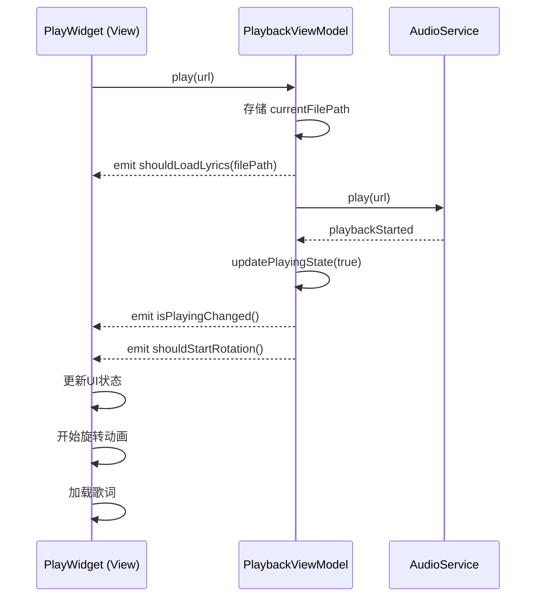
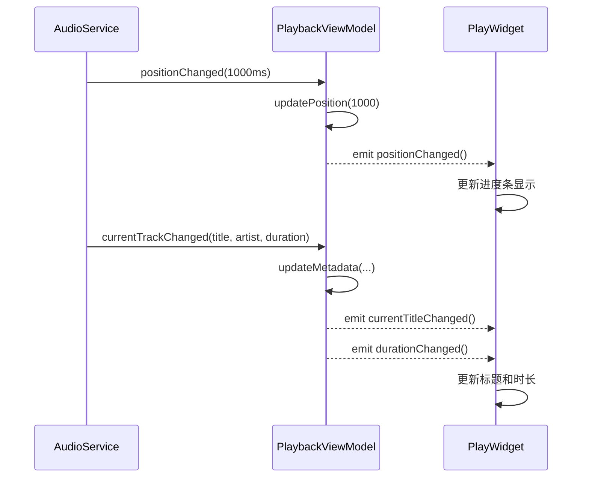

# MVVM 架构正确实现文档

## 改造完成时间
2026年2月9日

## 改造概述

成功将 PlayWidget 从直接依赖 AudioService 的架构，重构为**真正的 MVVM 架构**，UI 层只与 ViewModel 交互，完全解耦业务逻辑。

## 架构对比

### 改造前（伪MVVM）

```
┌─────────────┐
│  PlayWidget │
│   (UI层)    │
└──────┬──────┘
       │
       ├──────→ PlaybackViewModel (只是转发器)
       │              ↓
       └──────→ AudioService (UI直接监听)
                      ↓
                 AudioPlayer
```

**问题：**
- UI 直接监听 AudioService 信号
- ViewModel 只是简单转发，没有管理状态
- UI 和 Service 层耦合严重

### 改造后（真正的MVVM）

```
┌─────────────┐
│  PlayWidget │ ← UI层：只关心显示和用户交互
│   (View)    │
└──────┬──────┘
       │ 绑定属性/信号
       ↓
┌──────────────────┐
│PlaybackViewModel │ ← ViewModel层：管理状态、业务逻辑
│  (ViewModel)     │
└──────┬───────────┘
       │ 调用服务
       ↓
┌─────────────┐
│AudioService │ ← Model/Service层：数据和音频处理
│  (Model)    │
└──────┬──────┘
       ↓
  AudioPlayer
```

**改进：**
- ✅ UI 只绑定 ViewModel 的属性和信号
- ✅ ViewModel 完全封装 AudioService，管理所有状态
- ✅ 清晰的职责分离，易于测试和维护

## 核心改动

### 1. PlaybackViewModel 增强

#### 新增属性
```cpp
Q_PROPERTY(QString currentFilePath READ currentFilePath NOTIFY currentFilePathChanged)
```

#### 新增信号
```cpp
// UI相关事件（ViewModel负责协调）
void shouldStartRotation();       // 通知UI开始旋转动画
void shouldStopRotation();        // 通知UI停止旋转动画
void shouldLoadLyrics(const QString& filePath);  // 通知UI加载歌词
void currentFilePathChanged();
```

#### 改进的方法实现

**play() 方法**
```cpp
void PlaybackViewModel::play(const QUrl& url)
{
    // 1. 存储文件路径
    QString filePath = url.isLocalFile() ? url.toLocalFile() : url.toString();
    if (m_currentFilePath != filePath) {
        m_currentFilePath = filePath;
        emit currentFilePathChanged();
        
        // 2. 通知UI加载歌词
        emit shouldLoadLyrics(filePath);
    }
    
    // 3. 调用Service播放
    if (m_audioService->play(url)) {
        updateMetadata("", "", "", "", url);
    } else {
        setErrorMessage("Failed to play: " + url.toString());
    }
}
```

**AudioService事件处理**
```cpp
void PlaybackViewModel::onAudioServicePlaybackStarted(const QString& sessionId, const QUrl& url)
{
    updatePlayingState(true);
    updatePausedState(false);
    updateMetadata("", "", "", "", url);
    
    // 通知UI开始旋转动画
    emit shouldStartRotation();
    emit playbackStarted();
}

void PlaybackViewModel::onAudioServicePlaybackPaused()
{
    updatePausedState(true);
    
    // 通知UI停止旋转动画
    emit shouldStopRotation();
}
```

### 2. PlayWidget 重构

#### 移除的依赖
```cpp
// 删除前
AudioService* audioService;  // ❌ 直接依赖

// 删除后
// ✅ 完全移除，只保留 ViewModel
PlaybackViewModel* m_playbackViewModel;
```

#### UI 信号连接（只绑定 ViewModel）

```cpp
// ========== MVVM架构：连接ViewModel信号到UI ==========

// 播放状态变化
connect(m_playbackViewModel, &PlaybackViewModel::isPlayingChanged, this, [this]() {
    bool playing = m_playbackViewModel->isPlaying();
    emit signal_playState(playing ? ProcessSliderQml::Play : ProcessSliderQml::Pause);
});

// 位置变化
connect(m_playbackViewModel, &PlaybackViewModel::positionChanged, this, [this]() {
    qint64 positionMs = m_playbackViewModel->position();
    int seconds = static_cast<int>(positionMs / 1000);
    process_slider->setCurrentSeconds(seconds);
});

// 时长变化
connect(m_playbackViewModel, &PlaybackViewModel::durationChanged, this, [this]() {
    qint64 durationMs = m_playbackViewModel->duration();
    duration = durationMs * 1000;  // 转为微秒
    process_slider->setMaxSeconds(durationMs / 1000);
});

// 专辑封面变化
connect(m_playbackViewModel, &PlaybackViewModel::currentAlbumArtChanged, this, [this]() {
    QString imagePath = m_playbackViewModel->currentAlbumArt();
    process_slider->setPicPath(imagePath);
    slot_updateBackground(imagePath);
    rotatingCircle->setImage(imagePath);
    
    // 添加到播放历史
    playlistHistory->addSong(
        m_playbackViewModel->currentFilePath(), 
        currentSongTitle, 
        currentSongArtist, 
        imagePath
    );
});

// 旋转动画控制
connect(m_playbackViewModel, &PlaybackViewModel::shouldStartRotation, this, [this]() {
    emit signal_stop_rotate(true);
});

connect(m_playbackViewModel, &PlaybackViewModel::shouldStopRotation, this, [this]() {
    emit signal_stop_rotate(false);
});

// 歌词加载
connect(m_playbackViewModel, &PlaybackViewModel::shouldLoadLyrics, this, [this](const QString& filePath) {
    this->filePath = filePath;
    _begin_take_lrc(filePath);
});
```

#### 播放控制（通过 ViewModel）

**播放歌曲**
```cpp
void PlayWidget::_play_click(QString songPath)
{
    // 准备URL
    QUrl url = songPath.startsWith("http", Qt::CaseInsensitive) 
        ? QUrl(songPath) 
        : QUrl::fromLocalFile(songPath);
    
    // 通过ViewModel播放
    m_playbackViewModel->play(url);
    
    // ViewModel会自动：
    // 1. 调用AudioService播放
    // 2. 更新内部状态（isPlaying, position, duration等）
    // 3. 发出shouldLoadLyrics信号触发歌词加载
    // 4. 发出shouldStartRotation信号触发旋转动画
}
```

**切换播放/暂停**
```cpp
void PlayWidget::slot_play_click()
{
    // 检查是否播放完成后重新开始
    if (currentState == ProcessSliderQml::Stop && currentTime == 0) {
        QUrl url = m_playbackViewModel->currentFilePath().startsWith("http") 
            ? QUrl(m_playbackViewModel->currentFilePath()) 
            : QUrl::fromLocalFile(m_playbackViewModel->currentFilePath());
        m_playbackViewModel->play(url);
        return;
    }
    
    // 切换播放/暂停
    m_playbackViewModel->togglePlayPause();
    
    // UI状态会自动通过ViewModel的isPlayingChanged信号更新
}
```

**进度跳转**
```cpp
connect(process_slider, &ProcessSliderQml::signal_Slider_Move, this, [this](int seconds){
    qint64 milliseconds = static_cast<qint64>(seconds) * 1000;
    
    // 使用ViewModel进行跳转
    m_playbackViewModel->seekTo(milliseconds);
});
```

**音量控制**
```cpp
connect(process_slider, &ProcessSliderQml::signal_volumeChanged, this, [this](int volume) {
    m_playbackViewModel->setVolume(volume);
});
```

**上一首/下一首**
```cpp
connect(process_slider, &ProcessSliderQml::signal_nextSong, this, [this](){
    m_playbackViewModel->playNext();
});

connect(process_slider, &ProcessSliderQml::signal_lastSong, this, [this](){
    m_playbackViewModel->playPrevious();
});
```

### 3. 删除的旧代码

#### 移除条件编译宏
```cpp
// 删除
#define USE_MVVM_PLAYBACK  // ❌

// 所有 #ifdef USE_MVVM_PLAYBACK 都已删除
// 直接使用MVVM架构，没有旧模式兼容代码
```

#### 移除直接的 AudioService 连接
```cpp
// 删除
connect(audioService, &AudioService::playbackStarted, ...);  // ❌
connect(audioService, &AudioService::playbackPaused, ...);   // ❌
connect(audioService, &AudioService::positionChanged, ...);  // ❌
```

**保留的 AudioService 直接使用**
- 播放历史管理（playlist 操作）
- 播放模式设置
- 歌词同步（需要精确的时间控制）
- 缓冲状态提示

## MVVM 数据流

### 播放流程



### 状态更新流程



## 架构优势

### 1. 职责清晰

| 层级 | 职责 | 不应该做 |
|------|------|----------|
| **View (PlayWidget)** | 显示数据、响应用户交互 | 不直接访问Service、不包含业务逻辑 |
| **ViewModel (PlaybackViewModel)** | 管理状态、转换数据、业务逻辑 | 不直接操作UI控件、不了解View实现细节 |
| **Model/Service (AudioService)** | 数据处理、音频播放 | 不了解UI、不了解ViewModel |

### 2. 易于测试

```cpp
// 可以独立测试ViewModel，无需UI
TEST(PlaybackViewModelTest, PlayShouldUpdateState) {
    PlaybackViewModel vm;
    QSignalSpy spy(&vm, &PlaybackViewModel::isPlayingChanged);
    
    vm.play(QUrl::fromLocalFile("test.mp3"));
    
    EXPECT_EQ(spy.count(), 1);
    EXPECT_TRUE(vm.isPlaying());
}
```

### 3. 易于维护

- **修改UI**：只需修改PlayWidget，ViewModel不受影响
- **修改业务逻辑**：只需修改ViewModel，UI自动响应
- **替换Service**：只需修改ViewModel中的Service调用

### 4. 支持QML绑定

ViewModel 的所有属性都使用 `Q_PROPERTY`，可以直接在QML中绑定：

```qml
// 未来可以这样使用
Button {
    text: playbackViewModel.isPlaying ? "暂停" : "播放"
    enabled: playbackViewModel.duration > 0
    onClicked: playbackViewModel.togglePlayPause()
}

Slider {
    from: 0
    to: playbackViewModel.duration
    value: playbackViewModel.position
    onMoved: playbackViewModel.seekTo(value)
}

Text {
    text: playbackViewModel.currentTitle + " - " + playbackViewModel.currentArtist
}
```

## 性能考虑

### 信号频率优化

**高频信号（positionChanged）**
- AudioService 每100ms发出一次
- ViewModel 立即转发（状态已缓存，只发信号）
- UI 根据需要更新（进度条自动限流）

**低频信号（metadata）**
- ViewModel 内部去重：只有值真正改变才发出信号
- 避免不必要的UI更新

```cpp
void PlaybackViewModel::updatePosition(qint64 pos)
{
    if (m_position != pos) {  // 去重
        m_position = pos;
        emit positionChanged();
    }
}
```

## 遗留问题和改进方向

### 当前保留的直接 AudioService 访问

1. **播放历史管理**
   ```cpp
   // PlayWidget 中仍直接访问
   AudioService::instance().playlist()
   AudioService::instance().removeFromPlaylist(index)
   ```
   
   **改进方向**：创建 PlaylistViewModel 管理播放列表

2. **播放模式设置**
   ```cpp
   AudioService::instance().setPlayMode(playMode)
   ```
   
   **改进方向**：添加到 PlaybackViewModel
   ```cpp
   Q_PROPERTY(PlayMode playMode READ playMode WRITE setPlayMode NOTIFY playModeChanged)
   ```

3. **歌词同步**
   ```cpp
   // 仍直接监听AudioService::positionChanged
   connect(&AudioService::instance(), &AudioService::positionChanged, ...)
   ```
   
   **原因**：歌词需要精确的时间控制，而且是UI特有逻辑
   **保持现状**：这是合理的，不是所有逻辑都需要通过ViewModel

### 未来改进

1. **创建更多ViewModel**
   - `PlaylistViewModel` - 播放列表管理
   - `LyricViewModel` - 歌词状态和同步
   - `SettingsViewModel` - 应用设置

2. **状态持久化**
   - ViewModel 自动保存状态到 QSettings
   - 应用重启后恢复播放状态

3. **单元测试**
   - 为 ViewModel 添加完整的单元测试
   - Mock AudioService 进行隔离测试

## 总结

通过这次重构，我们实现了**真正的MVVM架构**：

✅ **View 层**：PlayWidget 只负责显示和用户交互，不包含业务逻辑
✅ **ViewModel 层**：PlaybackViewModel 管理状态、转换数据、协调UI事件
✅ **Model/Service 层**：AudioService 只负责音频处理和数据

这种架构具有：
- 🎯 清晰的职责分离
- 🧪 易于测试
- 🔧 易于维护
- 📱 支持QML绑定
- 🚀 为未来扩展打下良好基础

**对比之前的"伪MVVM"**，现在ViewModel不再是简单的转发器，而是真正管理状态的中间层，UI完全通过ViewModel进行所有播放控制操作。
