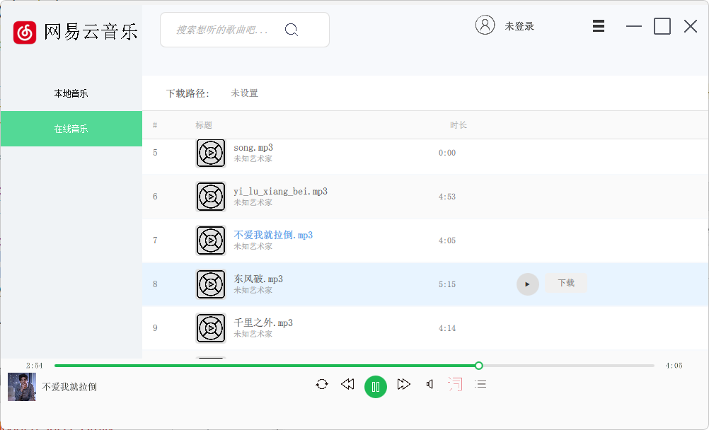
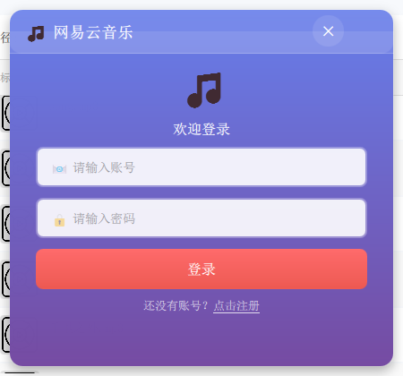

# FFmpeg Music Player

<div align="center">



一个基于 Qt5/Qt6 + QML + FFmpeg 的现代化音乐播放器，支持多种音频格式、在线音乐搜索、桌面歌词、插件扩展等功能。


</div>

## 🎵 功能特性

### 🎶 音乐播放
- **多格式支持**: 基于 FFmpeg 支持 MP3、FLAC、WAV、OGG、M4A 等主流音频格式
- **高品质音频**: 支持高采样率音频播放，保证音质
- **播放控制**: 播放、暂停、上一首、下一首、随机播放、循环播放
- **进度控制**: 支持拖拽进度条快速定位播放位置
- **音量控制**: 独立音量控制，支持静音功能

### 🎤 歌词功能
- **本地歌词**: 自动加载同名 LRC 歌词文件
- **在线歌词**: 支持在线搜索和下载歌词
- **桌面歌词**: 独立的桌面歌词窗口，支持透明背景
- **歌词同步**: 实时高亮显示当前播放行
- **歌词设置**: 可自定义歌词字体、颜色、大小等


### 🌐 在线功能
- **音乐搜索**: 支持在线搜索音乐资源
- **用户系统**: 登录注册功能，个人音乐收藏
- **音乐下载**: 支持在线音乐下载到本地



### 🎨 现代化界面
- **Qt + QML**: 混合架构，结合 Qt Widgets 稳定性和 QML 现代化 UI
- **响应式设计**: 自适应不同分辨率屏幕
- **美观界面**: 现代化的 Material Design 风格
- **主题支持**: 支持多种界面主题


### 🔌 插件系统
- **插件架构**: 基于动态库的插件系统，支持功能扩展
- **音频转换插件**: 内置音频格式转换功能
- **Whisper 翻译插件**: 支持语音识别和翻译功能
- **插件管理**: 自动扫描和加载插件

## 🏗️ 系统架构

### 整体架构
```
┌─────────────────────────────────────────────────────────────┐
│                    FFmpeg Music Player                      │
├─────────────────────────────────────────────────────────────┤
│  前端界面层 (Qt Widgets + QML)                               │
│  ├── Qt Widgets (主窗口框架)                                │
│  └── QML 组件 (现代化 UI 组件)                              │
├─────────────────────────────────────────────────────────────┤
│  业务逻辑层                                                  │
│  ├── 播放控制 (PlayWidget)                                  │
│  ├── 歌词处理 (LrcAnalyze)                                  │
│  ├── 音频处理 (Worker, TakePcm)                            │
│  └── 网络服务 (HttpRequest, DownloadThread)                │
├─────────────────────────────────────────────────────────────┤
│  插件系统层                                                  │
│  ├── 插件管理器 (PluginManager)                            │
│  ├── 插件接口 (PluginInterface)                            │
│  └── 插件实例 (AudioConverter, WhisperTranslate)           │
├─────────────────────────────────────────────────────────────┤
│  底层支持库                                                  │
│  ├── FFmpeg (音频解码/编码)                                │
│  ├── Qt Multimedia (音频播放)                              │
│  └── 网络通信 (HTTP/TCP)                                   │
└─────────────────────────────────────────────────────────────┘

┌─────────────────────────────────────────────────────────────┐
│                   Go 后端服务器                             │
├─────────────────────────────────────────────────────────────┤
│  API 服务层                                                 │
│  ├── 用户认证 API                                           │
│  ├── 音乐搜索 API                                           │
│  ├── 歌词服务 API                                           │
│  └── 文件下载 API                                           │
├─────────────────────────────────────────────────────────────┤
│  数据存储层                                                  │
│  ├── MySQL 数据库                                           │
│  └── Redis 缓存                                             │
└─────────────────────────────────────────────────────────────┘
```

### 技术栈
- **前端**: Qt 5.14+ / Qt 6.x, QML, C++17
- **音频处理**: FFmpeg 4.4+, Qt Multimedia
- **后端服务**: Go 1.22+, Gin 框架
- **数据库**: MySQL, Redis
- **构建系统**: CMake, qMake
- **插件系统**: 动态库 (DLL/SO)

## 🚀 快速开始

### 环境要求

#### 客户端环境
- **操作系统**: Windows 10+ / Ubuntu 18.04+ / macOS 10.14+
- **编译器**: 
  - Windows: Visual Studio 2019+ 或 MinGW-w64
  - Linux: GCC 7.5+ 或 Clang 6.0+
- **构建工具**: CMake 3.16+
- **依赖库**:
  - Qt 5.14+ 或 Qt 6.x (推荐 Qt 5.15.2)
  - FFmpeg 4.4+ 开发库
  - OpenSSL (用于网络通信)

#### 服务端环境
- **运行环境**: Go 1.22+
- **数据库**: MySQL 5.7+ / MySQL 8.0+
- **缓存**: Redis 6.0+
- **系统依赖**: 
  - MySQL C++ Connector
  - MySQL Client Library

### 安装部署

#### 1. 克隆项目
```bash
git clone https://github.com/shenxi11/ffmpeg_music_player.git
cd ffmpeg_music_player
```

#### 2. 客户端编译

##### Windows (推荐使用 Visual Studio)
```batch
# 配置 Qt 环境 (根据你的 Qt 安装路径修改)
set Qt5_DIR=E:\Qt5.15\5.15.2\msvc2019_64

# 使用提供的批处理脚本
configure_vs2022.bat
build_cmake.bat

# 或手动编译
mkdir build
cd build
cmake .. -G "Visual Studio 17 2022" -A x64
cmake --build . --config Release
```

##### Linux
```bash
# 安装依赖 (Ubuntu/Debian)
sudo apt update
sudo apt install qt5-default libqt5multimedia5-dev libavformat-dev libavcodec-dev libavutil-dev libswresample-dev

# 编译
mkdir build && cd build
cmake ..
make -j$(nproc)
```

#### 3. 服务端部署

```bash
# 进入服务端目录
cd GoTest

# 安装 Go 依赖
go mod tidy

# 配置数据库连接 (修改 config.yaml)
cp config.yaml.example config.yaml
vim config.yaml

# 编译并运行
go build -o music-server main.go
./music-server

# 或使用提供的脚本
chmod +x start_server.sh
./start_server.sh
```

#### 4. 数据库配置

```sql
-- 创建数据库
CREATE DATABASE music_player CHARACTER SET utf8mb4 COLLATE utf8mb4_unicode_ci;

-- 创建用户表
USE music_player;
CREATE TABLE users (
    id INT AUTO_INCREMENT PRIMARY KEY,
    username VARCHAR(50) UNIQUE NOT NULL,
    password_hash VARCHAR(255) NOT NULL,
    email VARCHAR(100),
    created_at TIMESTAMP DEFAULT CURRENT_TIMESTAMP
);

-- 创建音乐表
CREATE TABLE music_tracks (
    id INT AUTO_INCREMENT PRIMARY KEY,
    title VARCHAR(255) NOT NULL,
    artist VARCHAR(255),
    album VARCHAR(255),
    duration INT,
    file_path VARCHAR(500),
    lyric_path VARCHAR(500),
    created_at TIMESTAMP DEFAULT CURRENT_TIMESTAMP
);
```

### 运行程序

#### 启动服务端
```bash
cd GoTest
./start_server.sh
```

#### 启动客户端
```bash
# Windows
cd build/Release
./ffmpeg_music_player.exe

# Linux
cd build
./ffmpeg_music_player
```

## 📁 项目结构

```
ffmpeg_music_player/
├── 📁 客户端核心代码/
│   ├── main.cpp                    # 程序入口点
│   ├── main_widget.cpp/.h          # 主窗口框架
│   ├── play_widget.cpp/.h          # 播放控制核心
│   ├── worker.cpp/.h               # 音频处理工作线程
│   ├── take_pcm.cpp/.h             # PCM 音频数据处理
│   └── headers.h                   # 公共头文件
├── 📁 QML 现代化组件/
│   └── qml/components/
│       ├── PlayWidget.qml          # 播放控制界面
│       ├── LyricDisplay.qml        # 歌词显示组件
│       ├── DeskLyric.qml           # 桌面歌词
│       ├── ProcessSlider.qml       # 进度条组件
│       ├── ControlBar.qml          # 控制栏
│       ├── MusicListWidget.qml     # 音乐列表
│       └── LoginWindow.qml         # 登录窗口
├── 📁 业务功能模块/
│   ├── controlbar.cpp/.h           # 播放控制栏
│   ├── music_list_widget*.cpp/.h   # 音乐列表管理
│   ├── lrc_analyze.cpp/.h          # 歌词解析
│   ├── desk_lrc_*.cpp/.h           # 桌面歌词功能
│   ├── searchbox.cpp/.h            # 搜索功能
│   ├── loginwidget.cpp/.h          # 登录功能
│   └── setting_widget.cpp          # 设置界面
├── 📁 插件系统/
│   ├── plugin_interface.h          # 插件接口定义
│   ├── plugin_manager.cpp/.h       # 插件管理器
│   ├── plugin/                     # 编译后插件目录
│   └── plugins/                    # 插件源码
│       ├── audio_converter_plugin/ # 音频转换插件
│       └── whisper_translate_plugin/ # Whisper翻译插件
├── 📁 网络通信/
│   ├── httprequest.cpp/.h          # HTTP 请求封装
│   └── downloadthread.cpp/.h       # 下载线程
├── 📁 Go 后端服务/
│   └── GoTest/
│       ├── main.go                 # 服务器主程序
│       ├── config.yaml             # 服务器配置
│       ├── go.mod                  # Go 模块定义
│       └── library.cpp/.h/.so      # C++ 库集成
├── 📁 构建配置/
│   ├── CMakeLists.txt              # CMake 构建配置
│   ├── CMakePresets.json           # CMake 预设
│   ├── untitled.pro                # qMake 配置 (备用)
│   ├── *.bat                       # Windows 构建脚本
│   └── *.sh                        # Linux 构建脚本
├── 📁 资源文件/
│   ├── pic.qrc                     # 图片资源
│   ├── qml.qrc                     # QML 资源
│   ├── icon/                       # 图标文件
│   └── showImage/                  # 演示截图
│       ├── 主界面.png
│       ├── 桌面歌词.png
│       ├── 歌曲播放页面.png
│       └── 登录界面.png
└── 📁 文档/
    ├── README.md                   # 项目说明 (本文件)
    ├── PLUGIN_SYSTEM.md            # 插件系统文档
    ├── CMAKE_BUILD_GUIDE.md        # CMake 构建指南
    └── QT5_QT6_COMPATIBILITY.md    # Qt 版本兼容性
```

## 🔌 插件开发

### 插件接口

所有插件都需要实现 `PluginInterface` 接口：

```cpp
class PluginInterface {
public:
    virtual ~PluginInterface() = default;
    virtual QString name() const = 0;
    virtual QString version() const = 0;
    virtual QString description() const = 0;
    virtual bool initialize() = 0;
    virtual void cleanup() = 0;
};
```

### 创建新插件

1. 在 `plugins/` 目录下创建新文件夹
2. 实现插件��口
3. 创建 CMakeLists.txt 或 .pro 文件
4. 编译生成动态库到 `plugin/` 目录

详细说明请参考 [`plugins/PLUGIN_DEVELOPMENT.md`](plugins/PLUGIN_DEVELOPMENT.md)

## 📊 性能特性

- **多线程架构**: 音频处理、歌词解析、网络请求各自独立线程
- **内存管理**: 双缓冲管理器避免播放卡顿
- **异步 I/O**: 非阻塞网络请求和文件操作
- **缓存优化**: 智能缓存机制提升响应速度
- **低延迟**: 优化的音频处理管道，最小播放延迟

## 🛠️ 开发指南

### 代码规范
- C++ 标准: C++17
- 命名约定: 驼峰命名法 (camelCase)
- 注释语言: 中英文混合，关键部分提供英文注释
- 代码格式: 使用 clang-format 统一格式

### QML 组件开发
```qml
import QtQuick 2.15
import QtQuick.Controls 2.15

Item {
    id: root
    
    property alias text: label.text
    
    Rectangle {
        anchors.fill: parent
        color: "#f0f0f0"
        radius: 8
        
        Text {
            id: label
            anchors.centerIn: parent
            font.pixelSize: 14
        }
    }
}
```

### C++ 与 QML 集成
```cpp
// QQuickWidget 包装器示例
class MyComponentQml : public QQuickWidget {
    Q_OBJECT
public:
    explicit MyComponentQml(QWidget *parent = nullptr);
    
public slots:
    void setText(const QString &text);
    
signals:
    void buttonClicked();
    
private:
    void connectQmlSignals();
};
```

## 🧪 测试

### 单元测试
```bash
# 运行单元测试
cd build
make test

# 或使用 ctest
ctest -V
```

### 集成测试
```bash
# 启动测试服务器
cd GoTest
go test ./...

# 测试客户端连接
./ffmpeg_music_player --test-mode
```

## 📋 TODO

- [ ] 音乐可视化效果
- [ ] 播放列表管理优化
- [ ] 更多音频格式支持
- [ ] 移动端适配
- [ ] 云同步功能
- [ ] AI 音乐推荐
- [ ] 社交分享功能

## 🤝 贡献

欢迎提交 Issue 和 Pull Request！

### 贡献流程
1. Fork 项目
2. 创建功能分支 (`git checkout -b feature/AmazingFeature`)
3. 提交更改 (`git commit -m 'Add some AmazingFeature'`)
4. 推送到分支 (`git push origin feature/AmazingFeature`)
5. 创建 Pull Request

## 📄 许可证

本项目采用 MIT 许可证 - 详情请查看 [LICENSE](LICENSE) 文件

## 👨‍💻 作者

**shenxi11** - *项目创建者和主要维护者*

- GitHub: [@shenxi11](https://github.com/shenxi11)

## 🙏 致谢

感谢以下开源项目的支持：
- [Qt](https://www.qt.io/) - 跨平台应用开发框架
- [FFmpeg](https://ffmpeg.org/) - 多媒体处理库
- [Go](https://golang.org/) - 后端服务开发语言
- [Redis](https://redis.io/) - 高性能缓存数据库
- [MySQL](https://www.mysql.com/) - 关系型数据库

---

<div align="center">

**如果这个项目对你有帮助，请给个 ⭐ Star 支持一下！**

</div>
