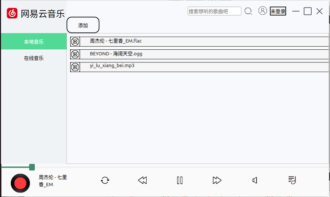
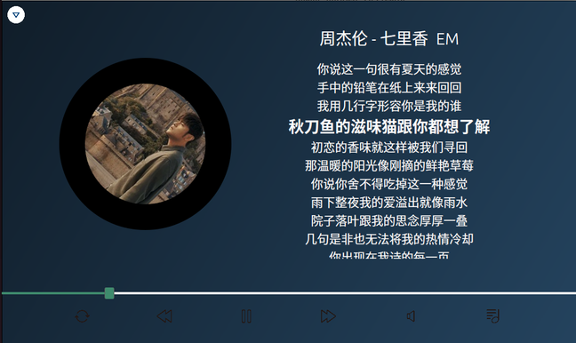

# 🎵 FFmpeg音乐播放器

基于Qt + FFmpeg + Whisper.cpp的全功能音乐播放器，集成本地播放、在线流媒体、AI音频识别等功能。

## ✨ 项目亮点

- **基于FFmpeg的多线程音频解码与双缓冲播放架构**：实现生产者-消费者模式的音频流处理，支持多格式解码和精确时间同步
- **集成Whisper.cpp本地AI音频识别功能**：支持7种语言的离线音频转文字，提供多种字幕格式输出和实时进度反馈
- **HTTP连接池与在线流媒体播放系统**：实现连接复用优化、流式音频播放和完整的用户云端同步功能
- **多线程并发优化与现代化UI设计**：采用线程安全的异步处理架构，结合Qt自绘实现响应式界面和桌面歌词系统

## 🏗️ 系统架构

```
┌─────────────────────────────────────────────────────────────┐
│                    Qt客户端 (C++)                            │
├─────────────────┬───────────────────┬───────────────────────┤
│   音频播放模块   │    AI识别模块      │      网络模块         │
│   - FFmpeg解码  │   - Whisper.cpp   │   - HTTP连接池        │
│   - 双缓冲播放  │   - 多语言识别     │   - 流媒体播放        │
│   - 时间同步    │   - 格式转换       │   - 用户系统          │
└─────────────────┴───────────────────┴───────────────────────┘
                            │
                    ┌───────┴───────┐
                    │   网络通信     │
                    │   HTTP/REST   │
                    └───────┬───────┘
                            │
┌─────────────────────────────────────────────────────────────┐
│                   Go服务端                                   │
├─────────────────┬───────────────────┬───────────────────────┤
│   音频处理      │     数据存储       │     缓存系统          │
│   - 格式支持    │     - MySQL       │     - Redis           │
│   - 元数据提取  │     - 用户管理     │     - 多级缓存        │
│   - 文件管理    │     - 播放记录     │     - 会话管理        │
└─────────────────┴───────────────────┴───────────────────────┘
```

## 🚀 核心功能

### 🎶 音频播放
- **多格式支持**：MP3、WAV、FLAC、AAC等主流音频格式
- **高质量解码**：基于FFmpeg的专业音频解码引擎
- **无缝播放**：双缓冲机制确保流畅播放体验
- **精确控制**：毫秒级进度控制和时间同步

### 🤖 AI音频识别
- **本地处理**：基于Whisper.cpp的离线识别，保护隐私
- **多语言支持**：中文、英文、日语、韩语、法语、德语、西班牙语
- **多种输出**：TXT、SRT、VTT、JSON、LRC等格式
- **实时反馈**：转换进度实时显示

### 🌐 在线功能
- **流媒体播放**：支持在线音乐流式播放
- **用户系统**：登录、注册、播放列表同步
- **音乐下载**：支持在线音乐下载到本地
- **歌词同步**：在线LRC歌词获取和显示

### 🎨 界面设计
- **现代UI**：参考主流音乐软件的设计风格
- **桌面歌词**：独立桌面歌词窗口，支持自定义
- **响应式布局**：适配不同窗口尺寸
- **主题支持**：明暗主题切换

## 🛠️ 技术栈

### 客户端 (Qt/C++)
- **框架**: Qt 5.14.2 Widgets
- **音频处理**: FFmpeg 4.4
- **AI模型**: Whisper.cpp (OpenAI Whisper)
- **网络通信**: QNetworkAccessManager
- **并发处理**: C++11 std::thread + Qt多线程

### 服务端 (Go)
- **语言**: Go 1.21+
- **数据库**: MySQL 8.0
- **缓存**: Redis 6.0+
- **配置**: YAML配置文件
- **部署**: Docker支持

## 📁 项目结构

```
ffmpeg_music_player/
├── 客户端代码/
│   ├── main_widget.cpp          # 主窗口
│   ├── play_widget.cpp          # 播放控件
│   ├── translate_widget.cpp     # AI识别界面
│   ├── music_list_widget*.cpp   # 音乐列表
│   ├── worker.cpp               # 音频播放线程
│   ├── take_pcm.cpp            # 音频解码
│   ├── httprequest.cpp         # 网络请求
│   └── ...
├── GoTest/                      # Go服务端
│   ├── main.go                 # 服务入口
│   ├── config.yaml             # 配置文件
│   ├── library.cpp             # C++数据库模块
│   └── ...
├── icon/                       # 图标资源
└── README.md
```

## 🔧 编译环境

- **操作系统**: Ubuntu 24.04 LTS (推荐)
- **编译器**: GCC 9.5.0+
- **构建工具**: qMake
- **依赖库**: 
  - Qt 5.14.2+
  - FFmpeg 4.4+
  - Whisper.cpp
  - MySQL客户端库
  - Redis客户端库

## 🚀 快速开始

### 客户端编译
```bash
# 克隆项目
git clone https://github.com/shenxi11/ffmpeg_music_player.git
cd ffmpeg_music_player

# 使用qMake编译
qmake untitled.pro
make

# 运行
./untitled
```

### 服务端部署
```bash
# 进入服务端目录
cd GoTest

# 编译Go服务
go build -o music_server main.go

# 配置数据库和Redis
cp config.yaml.example config.yaml
# 编辑config.yaml配置文件

# 启动服务
./start_server.sh
```

## 📱 功能演示

### 主界面


### 播放界面


## 🤝 贡献指南

欢迎提交Issue和Pull Request来帮助改进项目！

## 📄 开源协议

本项目采用 MIT 协议开源。

## 📞 联系方式

- GitHub: [@shenxi11](https://github.com/shenxi11)
- 项目地址: [ffmpeg_music_player](https://github.com/shenxi11/ffmpeg_music_player)

---
⭐ 如果这个项目对你有帮助，请给个星星支持一下！
