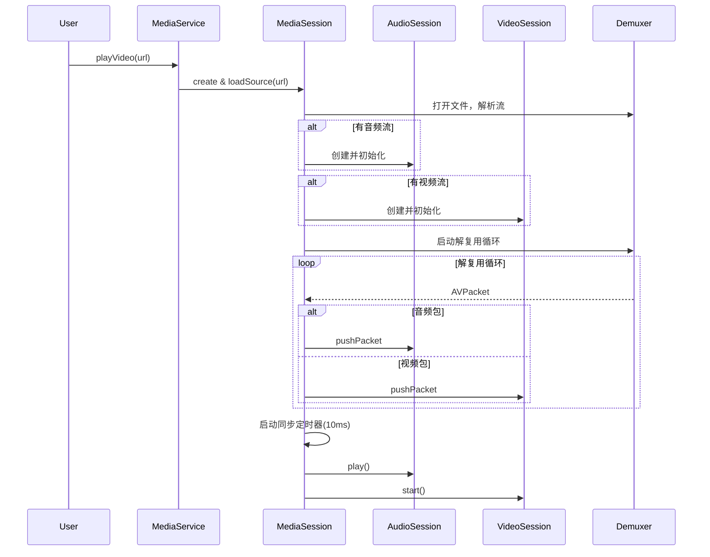
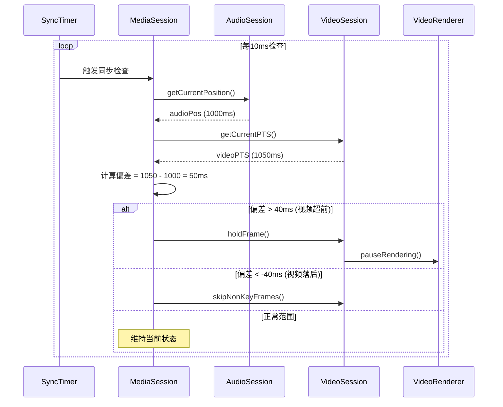
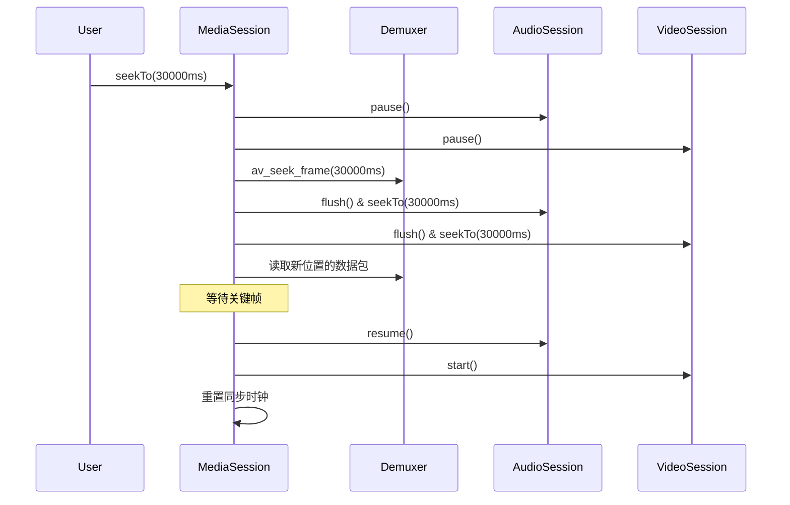

# 视频播放架构设计（基于音频架构复用）

## 一、设计原则

### 1. 复用现有音频架构
- **AudioService/AudioSession/AudioDecoder/AudioPlayer/AudioBuffer** - 完全复用，处理音频流
- 视频组件与音频组件协同工作，而非重新实现

### 2. 模块化设计
- 视频模块职责单一，专注视频解码和渲染
- 通过同步控制器协调音视频
- 保持与音频架构相同的设计风格

### 3. 最小侵入性
- 不修改现有音频组件
- 通过接口和信号槽通信
- 可独立测试和部署

---

## 二、架构总览

```
┌─────────────────────────────────────────────────────────────────┐
│                      MediaService.h                             │
│                (媒体服务协调层 - 单例模式)                        │
│   • 管理音频和视频会话  • 播放列表  • 全局控制                   │
└────────────────────┬────────────────────────────────────────────┘
                     │
        ┌────────────┴─────────────┐
        │   MediaSession.h         │
        │   (媒体会话管理层)         │
        │   • 管理音频和视频会话     │
        │   • 音视频同步协调         │
        │   • 元数据管理            │
        └────┬──────────┬──────────┘
             │          │
    ┌────────▼────┐  ┌─▼──────────────┐
    │AudioSession │  │ VideoSession   │
    │ (音频会话)   │  │ (视频会话)      │
    │ [复用现有]   │  │ [新增]          │
    └─────────────┘  └─┬──────────────┘
                       │
              ┌────────┴────────┐
              │                 │
       ┌──────▼─────┐    ┌─────▼──────┐
       │VideoDecoder│    │VideoRenderer│
       │(视频解码器) │    │(视频渲染器)  │
       │• FFmpeg解码│    │• QML渲染    │
       │• 帧缓冲    │    │• 帧率控制   │
       └────────────┘    └────────────┘
                │
         ┌──────▼────────┐
         │  VideoBuffer  │
         │ (视频帧缓冲区) │
         │ • 优先级队列  │
         │ • PTS排序     │
         └───────────────┘
```

---

## 三、核心组件设计

### 1. MediaService（媒体服务）- 复用并扩展AudioService

**职责**：
- 统一管理音频和视频播放
- 创建和管理MediaSession
- 播放列表管理（支持音视频混合）
- 全局播放控制

**扩展方案**：
```cpp
class MediaService : public AudioService {
    Q_OBJECT
public:
    static MediaService& instance();
    
    // 复用AudioService的所有接口
    // 新增视频相关接口
    bool playVideo(const QUrl& url);
    bool playAudio(const QUrl& url);  // 纯音频
    
    MediaSession* currentMediaSession() const;
    bool hasVideo() const;
    
signals:
    void mediaSessionCreated(MediaSession* session);
    void videoMetadataReady(QString title, qint64 duration);
    void audioOnlyMode();  // 纯音频模式
    void videoMode();      // 视频模式
    
private:
    QMap<QString, MediaSession*> m_mediaSessions;
    MediaSession* m_currentMediaSession;
    
    // 检测媒体类型
    bool detectMediaType(const QUrl& url);
};
```

**实现方式**：
- 继承或包装AudioService
- 检测文件类型（纯音频 vs 音视频）
- 纯音频：使用AudioSession
- 音视频：创建MediaSession（包含AudioSession + VideoSession）

---

### 2. MediaSession（媒体会话）- 协调音视频

**职责**：
- 管理一个完整的媒体播放会话
- 协调AudioSession和VideoSession
- 音视频同步控制
- 统一的播放控制接口

**核心设计**：
```cpp
class MediaSession : public QObject {
    Q_OBJECT
public:
    explicit MediaSession(QObject* parent = nullptr);
    ~MediaSession();
    
    // 加载媒体源
    bool loadSource(const QUrl& url);
    
    // 播放控制
    void play();
    void pause();
    void stop();
    void seekTo(qint64 positionMs);
    
    // 获取子会话
    AudioSession* audioSession() const { return m_audioSession; }
    VideoSession* videoSession() const { return m_videoSession; }
    
    // 同步控制
    void enableSync(bool enable);
    qint64 getCurrentPosition() const;
    bool hasVideo() const { return m_videoSession != nullptr; }
    bool hasAudio() const { return m_audioSession != nullptr; }
    
signals:
    void positionChanged(qint64 positionMs);
    void syncError(int offsetMs);  // 音视频不同步
    void metadataReady(QString title, QString artist, qint64 duration);
    void stateChanged(PlaybackState state);
    
private slots:
    void onAudioPositionChanged(qint64 audioPos);
    void onVideoFrameRendered(qint64 videoPts);
    void syncAudioVideo();
    void onDemuxPacket();
    
private:
    // 子会话
    AudioSession* m_audioSession;
    VideoSession* m_videoSession;
    
    // FFmpeg解复用
    AVFormatContext* m_formatContext;
    int m_audioStreamIndex;
    int m_videoStreamIndex;
    
    // 同步控制
    QTimer* m_syncTimer;
    QTimer* m_demuxTimer;
    bool m_syncEnabled;
    qint64 m_masterClock;  // 主时钟（以音频为准）
    
    // 解复用线程
    QThread* m_demuxThread;
    bool m_demuxRunning;
    
    void initDemuxer();
    void startDemux();
    void stopDemux();
    void demuxLoop();
};
```

**关键逻辑**：

1. **初始化**：
```cpp
bool MediaSession::loadSource(const QUrl& url) {
    // 打开媒体文件
    QString path = url.isLocalFile() ? url.toLocalFile() : url.toString();
    int ret = avformat_open_input(&m_formatContext, 
                                   path.toUtf8().data(), 
                                   nullptr, nullptr);
    if (ret < 0) return false;
    
    avformat_find_stream_info(m_formatContext, nullptr);
    
    // 查找音视频流
    m_audioStreamIndex = av_find_best_stream(m_formatContext, 
                                              AVMEDIA_TYPE_AUDIO, 
                                              -1, -1, nullptr, 0);
    m_videoStreamIndex = av_find_best_stream(m_formatContext, 
                                              AVMEDIA_TYPE_VIDEO, 
                                              -1, -1, nullptr, 0);
    
    // 创建音频会话（复用现有）
    if (m_audioStreamIndex >= 0) {
        m_audioSession = new AudioSession(this);
        AVStream* audioStream = m_formatContext->streams[m_audioStreamIndex];
        // 初始化AudioDecoder...
    }
    
    // 创建视频会话（新增）
    if (m_videoStreamIndex >= 0) {
        m_videoSession = new VideoSession(this);
        AVStream* videoStream = m_formatContext->streams[m_videoStreamIndex];
        m_videoSession->initVideoStream(videoStream);
    }
    
    // 启动解复用线程
    startDemux();
    
    return true;
}
```

2. **解复用循环**：
```cpp
void MediaSession::demuxLoop() {
    AVPacket* pkt = av_packet_alloc();
    
    while (m_demuxRunning && av_read_frame(m_formatContext, pkt) >= 0) {
        if (pkt->stream_index == m_audioStreamIndex) {
            // 传递给AudioDecoder
            if (m_audioSession) {
                // 将AVPacket转换为AudioSession可用的格式
                m_audioSession->decoder()->pushPacket(pkt);
            }
        } 
        else if (pkt->stream_index == m_videoStreamIndex) {
            // 传递给VideoDecoder
            if (m_videoSession) {
                m_videoSession->pushPacket(pkt);
            }
        }
        av_packet_unref(pkt);
    }
    
    av_packet_free(&pkt);
    emit demuxFinished();
}
```

3. **同步机制**：
```cpp
void MediaSession::syncAudioVideo() {
    if (!m_syncEnabled || !m_videoSession || !m_audioSession) 
        return;
    
    // 获取音频当前播放位置（主时钟）
    qint64 audioPos = m_audioSession->getCurrentPosition();
    
    // 获取视频当前PTS
    qint64 videoPos = m_videoSession->getCurrentPTS();
    
    // 计算偏差
    int offset = videoPos - audioPos;
    
    if (qAbs(offset) > 40) {  // 超过40ms需要同步
        if (offset > 0) {
            // 视频超前，暂停视频渲染
            m_videoSession->holdFrame();
            qDebug() << "Video ahead by" << offset << "ms, holding frame";
        } else {
            // 视频落后，跳过B帧加速
            m_videoSession->skipNonKeyFrames();
            qDebug() << "Video behind by" << -offset << "ms, skipping frames";
        }
        emit syncError(offset);
    }
}
```

---

### 3. VideoSession（视频会话）- 新增组件

**职责**：
- 管理视频解码和渲染
- 视频帧缓冲管理
- 提供PTS查询（用于同步）
- 帧率控制

**核心设计**：
```cpp
class VideoSession : public QObject {
    Q_OBJECT
public:
    explicit VideoSession(QObject* parent = nullptr);
    ~VideoSession();
    
    // 初始化
    bool initVideoStream(AVStream* stream);
    
    // 解码控制
    void start();
    void pause();
    void stop();
    void seekTo(qint64 positionMs);
    
    // 数据输入
    void pushPacket(AVPacket* packet);
    
    // 同步控制
    qint64 getCurrentPTS() const;  // 当前显示帧的PTS
    void holdFrame();  // 暂停渲染（等待音频追上）
    void skipNonKeyFrames();  // 跳过B/P帧加速追帧
    
    // 渲染输出
    VideoRenderer* videoRenderer() const { return m_renderer; }
    
signals:
    void frameRendered(qint64 pts);  // 帧已渲染
    void videoSizeChanged(QSize size);
    void decodingError(QString error);
    void bufferFull();
    void bufferEmpty();
    
private slots:
    void onFrameDecoded(VideoFrame* frame);
    
private:
    VideoDecoder* m_decoder;
    VideoRenderer* m_renderer;
    VideoBuffer* m_buffer;
    
    QThread* m_decodeThread;
    bool m_holdFrame;
    qint64 m_currentPTS;
};
```

**实现要点**：
```cpp
void VideoSession::pushPacket(AVPacket* packet) {
    // 将数据包传递给解码器
    if (m_decoder) {
        // 复制packet（因为原packet会被释放）
        AVPacket* pkt = av_packet_clone(packet);
        QMetaObject::invokeMethod(m_decoder, "decodePacket", 
                                  Qt::QueuedConnection,
                                  Q_ARG(AVPacket*, pkt));
    }
}

void VideoSession::holdFrame() {
    m_holdFrame = true;
    m_renderer->pauseRendering();
}

void VideoSession::skipNonKeyFrames() {
    m_buffer->clearNonKeyFrames();
}
```

---

### 4. VideoDecoder（视频解码器）- 新增组件

**职责**：
- FFmpeg视频解码
- 帧格式转换（YUV→RGB）
- 缓冲管理

**核心设计**：
```cpp
class VideoDecoder : public QObject {
    Q_OBJECT
public:
    explicit VideoDecoder(QObject* parent = nullptr);
    ~VideoDecoder();
    
    bool init(AVCodecContext* codecCtx);
    void decodePacket(AVPacket* packet);
    void flush();  // Seek时清空缓冲
    void stop();
    
signals:
    void frameDecoded(VideoFrame* frame);
    void decodingError(QString error);
    
private:
    AVCodecContext* m_codecCtx;
    SwsContext* m_swsCtx;  // 格式转换
    AVFrame* m_frame;
    VideoBuffer* m_buffer;
    
    bool m_running;
    
    VideoFrame* convertFrame(AVFrame* srcFrame);
};
```

**VideoFrame结构**：
```cpp
struct VideoFrame {
    QImage image;       // 转换后的RGB图像
    qint64 pts;         // 显示时间戳（毫秒）
    qint64 duration;    // 帧持续时间（毫秒）
    bool isKeyFrame;    // 是否关键帧
    QSize size;         // 帧尺寸
    
    VideoFrame() : pts(0), duration(0), isKeyFrame(false) {}
    ~VideoFrame() {}
};
```

**解码实现**：
```cpp
void VideoDecoder::decodePacket(AVPacket* packet) {
    int ret = avcodec_send_packet(m_codecCtx, packet);
    if (ret < 0) {
        emit decodingError("Failed to send packet");
        av_packet_free(&packet);
        return;
    }
    
    while (ret >= 0) {
        ret = avcodec_receive_frame(m_codecCtx, m_frame);
        if (ret == AVERROR(EAGAIN) || ret == AVERROR_EOF) {
            break;
        }
        if (ret < 0) {
            emit decodingError("Failed to receive frame");
            break;
        }
        
        // 转换格式并创建VideoFrame
        VideoFrame* videoFrame = convertFrame(m_frame);
        if (videoFrame) {
            emit frameDecoded(videoFrame);
        }
    }
    
    av_packet_free(&packet);
}

VideoFrame* VideoDecoder::convertFrame(AVFrame* srcFrame) {
    // YUV → RGB转换
    if (!m_swsCtx) {
        m_swsCtx = sws_getContext(
            srcFrame->width, srcFrame->height, 
            (AVPixelFormat)srcFrame->format,
            srcFrame->width, srcFrame->height, 
            AV_PIX_FMT_RGB24,
            SWS_BILINEAR, nullptr, nullptr, nullptr);
    }
    
    VideoFrame* frame = new VideoFrame();
    frame->size = QSize(srcFrame->width, srcFrame->height);
    frame->image = QImage(srcFrame->width, srcFrame->height, 
                          QImage::Format_RGB888);
    
    uint8_t* dst[] = { frame->image.bits() };
    int dstStride[] = { frame->image.bytesPerLine() };
    
    sws_scale(m_swsCtx, srcFrame->data, srcFrame->linesize, 
              0, srcFrame->height, dst, dstStride);
    
    // 设置时间戳
    frame->pts = srcFrame->pts * av_q2d(m_codecCtx->time_base) * 1000;
    frame->duration = srcFrame->pkt_duration * av_q2d(m_codecCtx->time_base) * 1000;
    frame->isKeyFrame = srcFrame->key_frame;
    
    return frame;
}
```

---

### 5. VideoRenderer（视频渲染器）- 新增组件

**职责**：
- 从缓冲区取帧渲染
- 帧率控制（30/60fps）
- Qt/QML集成

**核心设计**：
```cpp
class VideoRenderer : public QQuickPaintedItem {
    Q_OBJECT
    Q_PROPERTY(bool playing READ isPlaying WRITE setPlaying NOTIFY playingChanged)
    Q_PROPERTY(QSize videoSize READ videoSize NOTIFY videoSizeChanged)
    
public:
    explicit VideoRenderer(QQuickItem* parent = nullptr);
    
    void setVideoBuffer(VideoBuffer* buffer);
    void start();
    void pause();
    void pauseRendering();  // 同步控制
    void resumeRendering();
    
    bool isPlaying() const { return m_playing; }
    void setPlaying(bool playing);
    QSize videoSize() const { return m_videoSize; }
    
    // QQuickPaintedItem接口
    void paint(QPainter* painter) override;
    
signals:
    void playingChanged();
    void videoSizeChanged();
    void frameRendered(qint64 pts);
    
private slots:
    void renderNextFrame();
    
private:
    VideoBuffer* m_buffer;
    QTimer* m_renderTimer;
    QImage m_currentFrame;
    qint64 m_lastPTS;
    bool m_playing;
    QSize m_videoSize;
    int m_fps;  // 目标帧率
};
```

**渲染实现**：
```cpp
void VideoRenderer::renderNextFrame() {
    if (!m_playing || !m_buffer) return;
    
    VideoFrame* frame = m_buffer->peek();
    if (!frame) return;
    
    // 检查是否到显示时间
    qint64 currentTime = getCurrentPlaybackTime();  // 从AudioSession获取
    if (frame->pts > currentTime + 20) {
        // 还没到显示时间，等待
        return;
    }
    
    // 取出并显示帧
    frame = m_buffer->pop();
    m_currentFrame = frame->image;
    m_lastPTS = frame->pts;
    
    if (m_videoSize != frame->size) {
        m_videoSize = frame->size;
        emit videoSizeChanged();
    }
    
    delete frame;
    update();  // 触发重绘
    
    emit frameRendered(m_lastPTS);
}

void VideoRenderer::paint(QPainter* painter) {
    if (m_currentFrame.isNull()) return;
    
    QRectF target = boundingRect();
    QRectF source = m_currentFrame.rect();
    
    // 保持宽高比居中显示
    QSizeF scaled = source.size();
    scaled.scale(target.size(), Qt::KeepAspectRatio);
    
    QRectF destRect;
    destRect.setSize(scaled);
    destRect.moveCenter(target.center());
    
    painter->drawImage(destRect, m_currentFrame, source);
}
```

---

### 6. VideoBuffer（视频帧缓冲区）- 新增组件

**职责**：
- 按PTS排序存储视频帧
- 线程安全访问
- 动态容量控制

**核心设计**：
```cpp
class VideoBuffer {
public:
    VideoBuffer(int maxSize = 10);
    ~VideoBuffer();
    
    void push(VideoFrame* frame);  // 插入帧（自动按PTS排序）
    VideoFrame* pop();  // 取出最早的帧
    VideoFrame* peek() const;  // 查看但不取出
    
    int size() const;
    bool isFull() const;
    bool isEmpty() const;
    void clear();
    void clearNonKeyFrames();  // 清除非关键帧（追帧时）
    
private:
    QQueue<VideoFrame*> m_frames;  // 实际用优先级队列
    QMutex m_mutex;
    int m_maxSize;
    
    void insertSorted(VideoFrame* frame);
};
```

**实现要点**：
```cpp
void VideoBuffer::push(VideoFrame* frame) {
    QMutexLocker locker(&m_mutex);
    
    if (m_frames.size() >= m_maxSize) {
        // 缓冲满了，丢弃最老的非关键帧
        for (int i = 0; i < m_frames.size(); ++i) {
            if (!m_frames[i]->isKeyFrame) {
                delete m_frames.takeAt(i);
                break;
            }
        }
    }
    
    insertSorted(frame);
}

void VideoBuffer::insertSorted(VideoFrame* frame) {
    // 按PTS插入排序
    int i = 0;
    for (; i < m_frames.size(); ++i) {
        if (m_frames[i]->pts > frame->pts) {
            break;
        }
    }
    m_frames.insert(i, frame);
}

void VideoBuffer::clearNonKeyFrames() {
    QMutexLocker locker(&m_mutex);
    
    for (int i = m_frames.size() - 1; i >= 0; --i) {
        if (!m_frames[i]->isKeyFrame) {
            delete m_frames.takeAt(i);
        }
    }
}
```

---

## 四、关键流程

### 1. 启动播放流程



### 2. 音视频同步流程



### 3. Seek流程



---

## 五、与现有AudioSession的集成方案

### 方案A：扩展AudioDecoder（推荐）

在AudioDecoder中添加接口接收AVPacket：

```cpp
// AudioDecoder.h
class AudioDecoder : public QObject {
    // ... 现有接口 ...
    
    // 新增接口
    void pushPacket(AVPacket* packet);  // 接收解复用后的音频包
    
private:
    AVCodecContext* m_codecCtx;  // 如果还没有的话
};

// AudioDecoder.cpp
void AudioDecoder::pushPacket(AVPacket* packet) {
    // 解码packet
    int ret = avcodec_send_packet(m_codecCtx, packet);
    // ... 接收帧并输出PCM ...
}
```

### 方案B：MediaSession内部管理（备选）

MediaSession直接管理音频解码，将PCM数据传递给AudioSession：

```cpp
void MediaSession::demuxLoop() {
    while (m_running) {
        AVPacket* pkt = av_packet_alloc();
        av_read_frame(m_formatContext, pkt);
        
        if (pkt->stream_index == m_audioStreamIndex) {
            // 直接解码
            AVFrame* frame = decodeAudioPacket(pkt);
            // 转换为PCM
            QByteArray pcmData = convertToPCM(frame);
            // 传递给AudioPlayer
            m_audioSession->player()->writeAudioData(pcmData);
        }
    }
}
```

**推荐方案A**：更模块化，AudioDecoder负责解码，MediaSession只负责分发数据包。

---

## 六、QML集成

### 1. 注册C++类型

```cpp
// main.cpp
qmlRegisterType<VideoRenderer>("VideoPlayer", 1, 0, "VideoRenderer");
qmlRegisterType<MediaSession>("VideoPlayer", 1, 0, "MediaSession");
```

### 2. QML使用示例

```qml
import QtQuick 2.15
import QtQuick.Controls 2.15
import VideoPlayer 1.0

Item {
    id: root
    
    // 视频渲染器
    VideoRenderer {
        id: videoRenderer
        anchors.fill: parent
        playing: mediaSession.isPlaying
    }
    
    // 媒体会话（由C++创建并暴露给QML）
    property MediaSession mediaSession: null
    
    // 连接信号
    Connections {
        target: mediaSession
        function onPositionChanged(position) {
            progressSlider.value = position
        }
        
        function onMetadataReady(title, artist, duration) {
            titleText.text = title
            progressSlider.to = duration
        }
    }
    
    // 控制栏
    Row {
        anchors.bottom: parent.bottom
        spacing: 10
        
        Button {
            text: mediaSession.isPlaying ? "暂停" : "播放"
            onClicked: {
                if (mediaSession.isPlaying)
                    mediaSession.pause()
                else
                    mediaSession.play()
            }
        }
        
        Slider {
            id: progressSlider
            width: 400
            onMoved: mediaSession.seekTo(value)
        }
    }
}
```

### 3. C++暴露给QML

```cpp
// PlayWidget或MainWidget中
MediaSession* session = mediaService->currentMediaSession();
engine.rootContext()->setContextProperty("mediaSession", session);

// 设置VideoRenderer的缓冲区
VideoRenderer* renderer = qmlObject->findChild<VideoRenderer*>();
if (renderer && session->videoSession()) {
    renderer->setVideoBuffer(session->videoSession()->buffer());
}
```

---

## 七、性能优化

### 1. 多线程策略
- **解复用线程**：MediaSession独立线程读取数据包
- **音频解码线程**：AudioDecoder独立线程（复用现有）
- **视频解码线程**：VideoDecoder独立线程
- **UI线程**：VideoRenderer在UI线程渲染

### 2. 内存管理
- VideoFrame使用智能指针或对象池
- 及时释放已渲染的帧
- 缓冲区大小动态调整（网络播放时增大）

### 3. 硬件加速（可选扩展）
```cpp
// 检测硬件解码支持
bool VideoDecoder::initHardwareDecoder() {
    AVHWDeviceType type = av_hwdevice_find_type_by_name("dxva2");  // Windows
    // AVHWDeviceType type = av_hwdevice_find_type_by_name("vaapi");  // Linux
    
    if (type != AV_HWDEVICE_TYPE_NONE) {
        m_hwDeviceCtx = av_hwdevice_ctx_alloc(type);
        // 初始化硬件设备...
    }
}
```

---

## 八、测试策略

### 1. 单元测试
- VideoBuffer的push/pop/排序逻辑
- VideoDecoder的YUV→RGB转换
- 同步算法的偏差计算

### 2. 集成测试
- 纯音频文件播放（降级为AudioSession）
- 纯视频文件播放（无音频流）
- 音视频文件播放（完整流程）
- Seek操作

### 3. 性能测试
- 1080p视频解码帧率
- 内存占用
- CPU使用率

---

## 九、实施计划

### 阶段1：基础框架（Week 1）
- [x] 删除旧的视频文件
- [ ] 创建MediaService（扩展AudioService）
- [ ] 创建MediaSession骨架
- [ ] 定义VideoSession/VideoDecoder/VideoRenderer接口

### 阶段2：视频解码（Week 2）
- [ ] 实现VideoDecoder（FFmpeg软解）
- [ ] 实现VideoBuffer（帧缓冲）
- [ ] 集成FFmpeg解复用器到MediaSession
- [ ] 测试视频解码输出

### 阶段3：视频渲染（Week 3）
- [ ] 实现VideoRenderer（QML集成）
- [ ] 帧率控制
- [ ] UI集成和显示
- [ ] 测试视频播放

### 阶段4：音视频同步（Week 4）
- [ ] 实现同步算法
- [ ] AudioSession集成
- [ ] 测试音视频同步精度
- [ ] 调优同步参数

### 阶段5：完善和优化（Week 5）
- [ ] Seek优化
- [ ] 错误处理
- [ ] 性能优化
- [ ] 边界情况测试
- [ ] 文档完善

---

## 十、总结

### 核心优势
1. **完全复用音频架构** - AudioService/Session/Decoder/Player/Buffer不需要修改
2. **清晰的职责分离** - 音频和视频各自独立，通过MediaSession协调
3. **灵活的同步策略** - 可以选择音频为主时钟或视频为主时钟
4. **易于测试** - 可以单独测试视频组件，也可以单独测试音频组件
5. **支持纯音频播放** - 检测到没有视频流时，降级为纯音频播放

### 扩展方向
1. **字幕支持** - 添加SubtitleDecoder和SubtitleRenderer
2. **多音轨** - 支持音轨切换
3. **硬件加速** - VideoDecoder支持硬解（DXVA/VAAPI）
4. **直播流** - RTMP/HLS支持
5. **VR视频** - 360度视频渲染

### 关键技术点
- FFmpeg解复用和解码
- 音视频同步算法（PTS比较）
- Qt/QML集成
- 多线程协调
- 内存管理

通过这种设计，我们可以在不破坏现有音频架构的前提下，快速实现视频播放功能，并且保持代码的可维护性和可扩展性。
