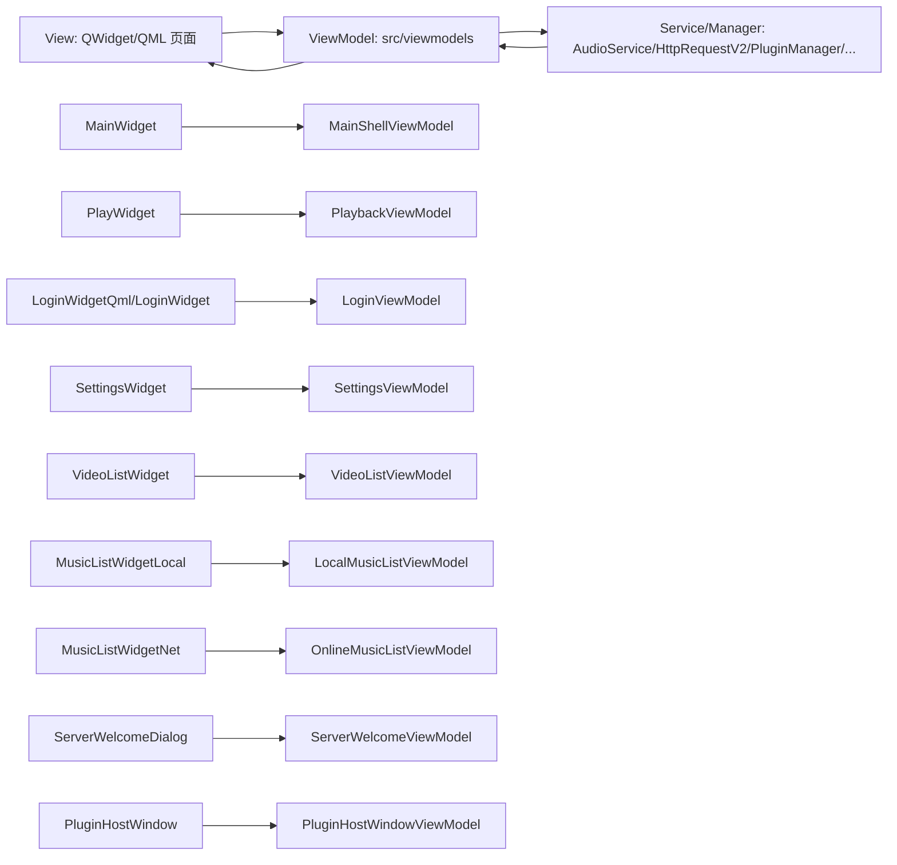

# UI-MVVM 架构与调用链路说明

## 1. 目标
本说明用于固化当前客户端 UI 层的 MVVM 实现边界，帮助后续开发在不破坏架构分层的前提下继续迭代。

## 2. 总体架构图

## 3. View 与 ViewModel 对应关系
- 主窗口壳层：`src/app/main_widget.cpp:99` -> `src/viewmodels/MainShellViewModel.h:16`
- 播放页：`src/ui/widgets/playback/play_widget.cpp` -> `src/viewmodels/PlaybackViewModel.h:15`
- 登录页（QML/Widget 双入口）：`src/ui/qml_bridge/auth/loginwidget_qml.h`、`src/ui/widgets/auth/loginwidget.cpp` -> `src/viewmodels/LoginViewModel.h:15`
- 设置页：`src/ui/widgets/settings/settings_widget.cpp` -> `src/viewmodels/SettingsViewModel.h:17`
- 在线视频页：`src/ui/widgets/video/video_list_widget.cpp` -> `src/viewmodels/VideoListViewModel.h:13`
- 本地音乐列表：`src/ui/widgets/library/music_list_widget_local.cpp` -> `src/viewmodels/LocalMusicListViewModel.h:15`
- 在线音乐列表：`src/ui/widgets/library/music_list_widget_net.cpp` -> `src/viewmodels/OnlineMusicListViewModel.h:15`
- 欢迎验证页：`src/ui/widgets/auth/server_welcome_dialog.cpp` -> `src/viewmodels/ServerWelcomeViewModel.h:17`
- 插件宿主窗口：`src/app/plugin_host_window.cpp` -> `src/viewmodels/PluginHostWindowViewModel.h:13`

## 4. 关键调用链路

### 4.1 主窗口与插件/网络聚合链路
1. `MainWidget` 初始化时创建 `MainShellViewModel`：`src/app/main_widget.cpp:99`
2. 主窗口通过 VM 加载插件：`src/viewmodels/MainShellViewModel.cpp:257`
3. 插件服务注册统一走 VM：`src/viewmodels/MainShellViewModel.cpp:282`
4. 插件诊断报告通过 VM 获取：`src/viewmodels/MainShellViewModel.cpp:277`

### 4.2 音频播放链路（播放控制层）
1. View 调用 `PlaybackViewModel::play/seekTo/...`：`src/viewmodels/PlaybackViewModel.h:53`
2. VM 下发到 `AudioService`：`src/viewmodels/PlaybackViewModel.cpp:47`、`src/viewmodels/PlaybackViewModel.cpp:83`
3. `AudioService` 回推播放状态，VM 收到后更新属性并发信号：`src/viewmodels/PlaybackViewModel.cpp:159`
4. View 只订阅属性和信号刷新 UI，不直接调底层服务。

### 4.3 在线音乐链路（搜索/播放地址/下载）
1. 主窗口触发搜索，VM 发起请求：`src/viewmodels/MainShellViewModel.cpp:142`
2. 在线列表点击播放时，`OnlineMusicListViewModel` 解析流地址：`src/viewmodels/OnlineMusicListViewModel.cpp:22`
3. 在线列表下载由 `OnlineMusicListViewModel` 发起并转发进度事件：`src/viewmodels/OnlineMusicListViewModel.cpp:31`

### 4.4 登录与自动登录链路
1. 登录页发起登录/注册/重置密码：`src/viewmodels/LoginViewModel.cpp:36`、`src/viewmodels/LoginViewModel.cpp:56`、`src/viewmodels/LoginViewModel.cpp:63`
2. 登录成功后由主壳 VM 处理会话与账号缓存：`src/viewmodels/MainShellViewModel.cpp:220`
3. 登出由主壳 VM 清理在线状态与本地账号状态：`src/viewmodels/MainShellViewModel.cpp:229`

### 4.5 最近播放/收藏数据闭环
1. 主窗口触发历史或收藏请求到 VM：`src/viewmodels/MainShellViewModel.h:49`、`src/viewmodels/MainShellViewModel.h:56`
2. 接口结果通过 VM 信号回到 View（列表刷新）。
3. 历史补偿信息（标题/艺术家/时长）统一在 VM 解析：`src/viewmodels/MainShellViewModel.cpp:322`

### 4.6 欢迎页服务验证链路
1. 欢迎页发起服务可达性验证：`src/viewmodels/ServerWelcomeViewModel.cpp:59`
2. VM 负责 host/port 规范化与接口校验：`src/viewmodels/ServerWelcomeViewModel.cpp:146`
3. 验证通过后由 View 进入主窗口流程。

## 5. 当前分层边界结论
- UI 页面已不直接访问核心业务单例（如用户、下载、本地缓存等），改由对应 ViewModel 中转。
- `main.cpp` 仍作为应用组装入口（Composition Root），保留框架初始化和启动流程，不纳入页面 MVVM 约束。
- 旧 `main_qml.cpp`/`qml_bridge` 路径已从默认构建排除（见 `CMakeLists.txt`），不再作为当前主链路。

## 6. 后续约束建议
1. 新增 UI 功能时先新增/扩展 ViewModel，再接入 View；禁止 View 直接调 Service 单例。
2. 网络返回数据统一在 ViewModel 转换为 UI 可消费模型（字符串格式化、空值兜底、事件去重）。
3. 与播放状态相关的新功能，优先挂接 `PlaybackViewModel`，避免状态源分裂。
